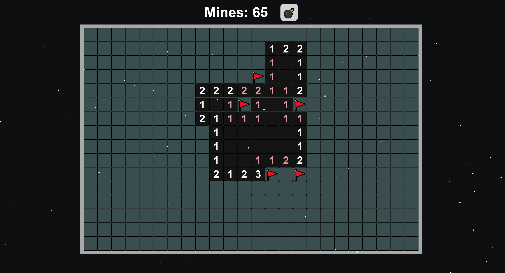
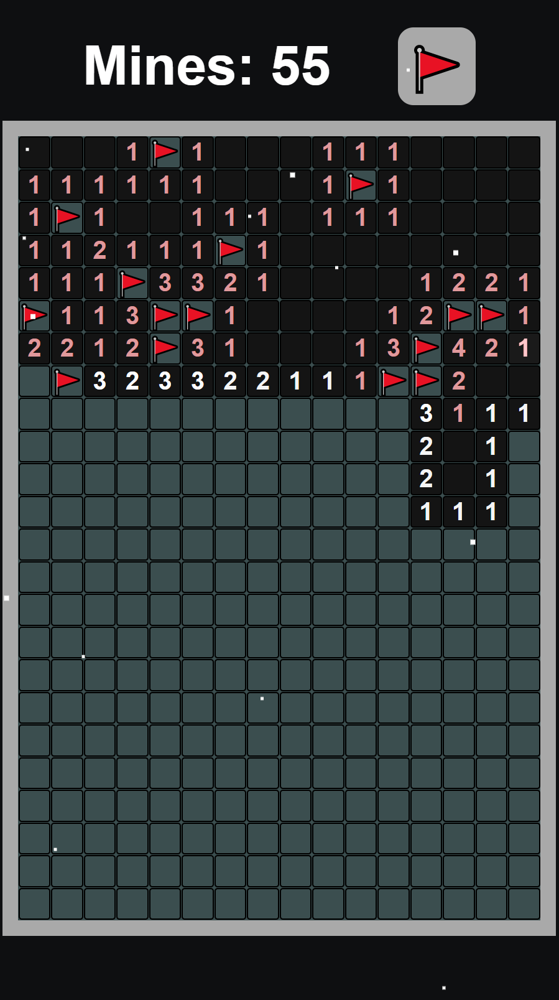

# Minesweeper - an HTML solution

This is a minesweeper application made to work on browsers. 

## Table of contents

- [Overview](#overview)
  - [The challenge](#the-challenge)
  - [Screenshot](#screenshot)
  - [Links](#links)
- [My process](#my-process)
  - [Built with](#built-with)
  - [What I learned](#what-i-learned)
  - [Continued development](#continued-development)
- [Author](#author)


## Overview

### The challenge

Set goals for the application:

- Create a complete minesweeper application with conventional functionalities
- Reveal cells on left click, flag on right click, swapped upon pressing on the flag button
- Revealed cells with an appropriate number of mines around them are highlighted
- Pressing on a revealed, highlighted cell reveals all cells around it
- First cell clicked never has a mine, nor do its neighbors
- Game ends upon revealing all cells not containing mines
- Game is over upon revealing a mine
- Adjusted for mobile usage
- Long press puts a mine, short press reveals a cell

### Screenshot
Initial state


Some cells revealed, cells with appropriate amount of mines highlighted in red and can be pressed to reveal their remaining neighbours




Mobile interface




### Links

- Live Site URL: [Github](https://mkab2000.github.io/minesweeper/)

## My process

### Built with

- Semantic HTML5 markup
- CSS custom properties
- Flexbox

### What I learned

Dynamic board population with cells based on the number of rows and columns given
```js
for (let r = 0; r < rows; r++){
    let row = [];
    for (let c = 0; c < columns; c++) {

        let tile = document.createElement("div");
        tile.id = r.toString() + "-" + c.toString();
        tile.addEventListener("click", clickTile);
        ["mousedown", "touchstart"].forEach(type => {
            tile.addEventListener(type, longPressTile);
        });
        ["mouseup", "touchend"].forEach(type => {
            tile.addEventListener(type, releaseTile);
        });
        tile.classList.add('board-cell');

        // if pc then add this event listener 
        if(window.outerWidth > 900){
            tile.addEventListener("contextmenu", (event) => {
                event.preventDefault();
                console.log("context")
                tileFlag(tile);
            })
        }
        

        document.getElementById("board").append(tile);
        row.push(tile);
    }
    board.push(row);
}
```

## Author

- Website - [miraskab](https://github.com/mkab2000)